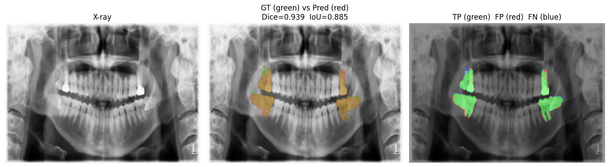

# U-Net Segmentation API

Production-grade **FastAPI** service for dental (panoramic X-ray) segmentation, accelerated with **ONNX Runtime**.

<p align="center">
  
</p>

---

## Model highlights

| Metric (490-image validation set) | Mean ± SD | Min | Max |
|-----------------------------------|-----------|-----|-----|
| **Dice** coefficient              | **0.906 ± 0.029** | 0.77 | 0.96 |
| IoU (Jaccard)                     | 0.830 ± 0.047 | 0.61 | 0.92 |
| Hausdorff distance (px)           | 15.9 ± 17.9 | 1.4 | 96.7 |

*Architecture:* custom U-Net, 64-512 channels, BCE + Dice loss, heavy albumentations.  
*Training:* PyTorch 1.13, SGD, 250 epochs on 2× A100.

---

## Quick Start

```bash
git clone https://github.com/<your-user>/unet-segmentation-api.git
cd unet-segmentation-api
python -m venv .venv && source .venv/bin/activate
pip install -r requirements.txt

# ── model ─────────────────────────────────────────────────────
# Option A: you already have ONNX weights
cp /path/to/unet_model_best.onnx weights/

# Option B: convert from a PyTorch checkpoint
python app/exporter.py --weights /path/to/unet_model_best.pth \
                       --out weights/unet_model_best.onnx

# ── run ───────────────────────────────────────────────────────
uvicorn app.main:app --reload
